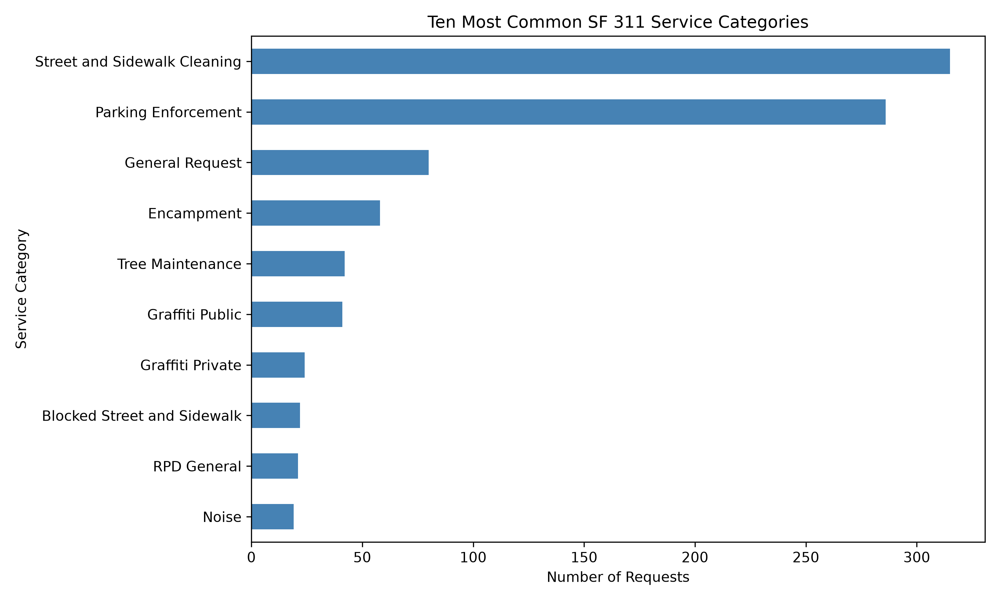
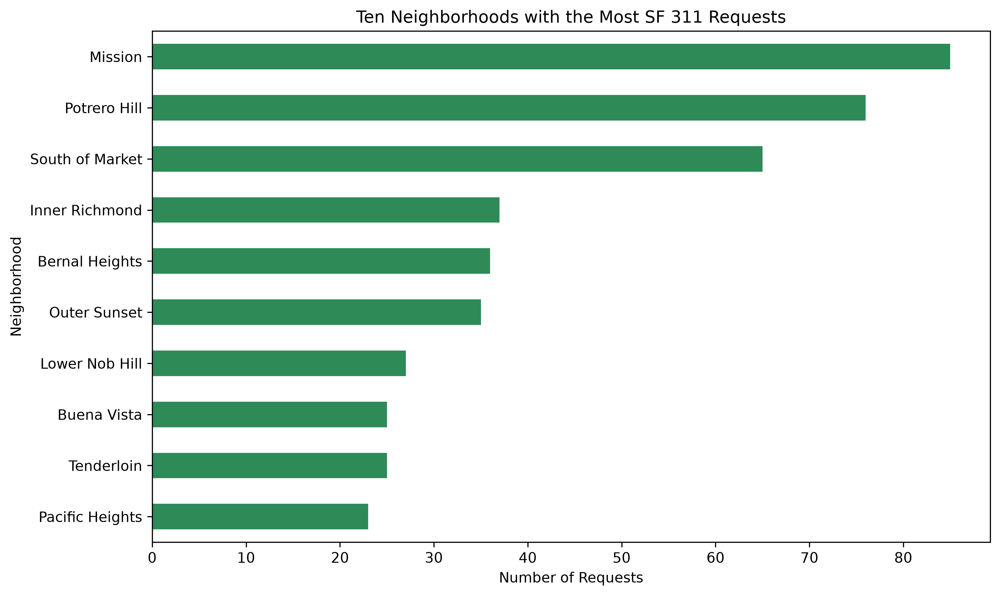
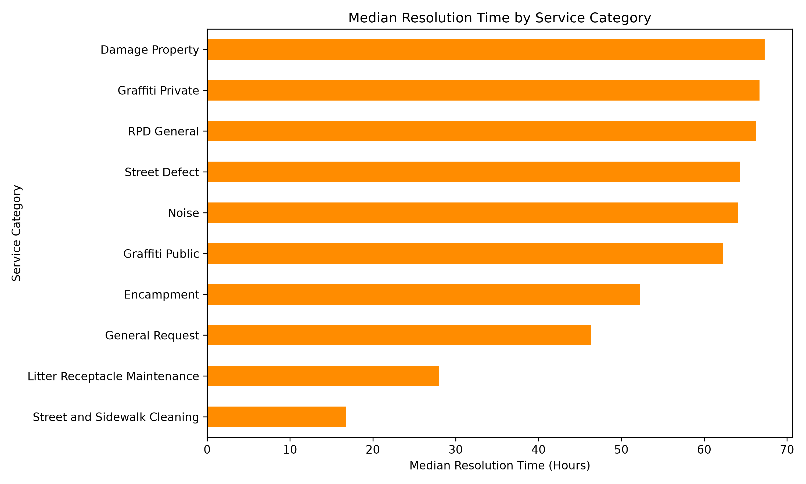

# SF-311-service-request-explorer
Explore patterns in San Francisco 311 service requests
## Research Questions
1. What are the most common request categories?
2. How does the request volume change over time?
3. How does the median resolution time differ by category?
## Project Scope
The first version will analyze closed service requests from the most recent 12 months
## Planned Visualization
- Top 10 request categories
- Monthly request volume
- Median resolution time by category
## Data Source
San Francisco 311 Cases:
https://data.sf.gov/d/vw6y-z8j6
## Status
Week 1 repository setup is complete
Current structure:

-Python entry point created
-Dependencies recorded
-Data-analysis questions defined
### Week 2 — Data Loading and Cleaning

**Status:**  Completed

This week, I loaded the data from SF 311 Cases dataset from Data SF  .

The cleaning function converted the requested and closed date to datetime type and cleaned, then created a new column'resolution_hours', then removed the rows where resolution hours<0.

I encountered a 403 Forbidden error when requesting data through the outdated
DataSF API hostname, which I resolved by changing the endpoint to the current
`data.sf.gov` SODA3 endpoint and providing a Socrata app token through an
environment variable.

Before beginning the next stage, I still need to verify the cleaned output and
commit and push my Week 2 changes to GitHub. 

Before beginning the next stage, I still need to verify cleaned output  .
### Sampling strategy

A historical pilot cohort was used to estimate the percentage of cases resolved
within different periods. Approximately 89.5% were resolved within 30 days,
compared with 92.1% within 60 days.

The project therefore uses a 30-day sampling delay. This provides approximately
90% resolution coverage while keeping the analyzed data reasonably current.
Cases still unresolved after 30 days are retained for status analysis but
excluded from calculations requiring a completed resolution time.
### Effect of the sampling strategy

The newest-request sample and the 30-day delayed sample produced substantially
different results. The newest sample contained more open requests, so its
resolution-time statistics disproportionately represented cases that were
resolved quickly.

The delayed sample contained more completed requests and was therefore used for
the main resolution-time analysis. However, some differences may also result
from changes in service categories or operating conditions over time.
### Week 3 — Exploratory Analysis and Visualization

**Status:** completed

This week, I analyzed a 1,000-request sample submitted at least 30 days earlier. Using a delayed sample reduced the bias caused by recently submitted requests that have not yet had enough time to close.

The analysis examined:

- The most common service categories
- The neighborhoods with the most requests
- Median and mean resolution times by service category
- Differences between the newest sample and the 30-day delayed sample

For service-category resolution comparisons, I included only categories with at least 10 closed requests. This prevents categories with very small sample sizes from dominating the rankings.

#### Most Common Service Categories

#### Requests by Neighborhood

#### Median Resolution Time by Service Category

